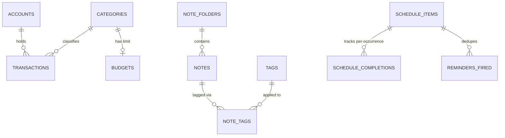
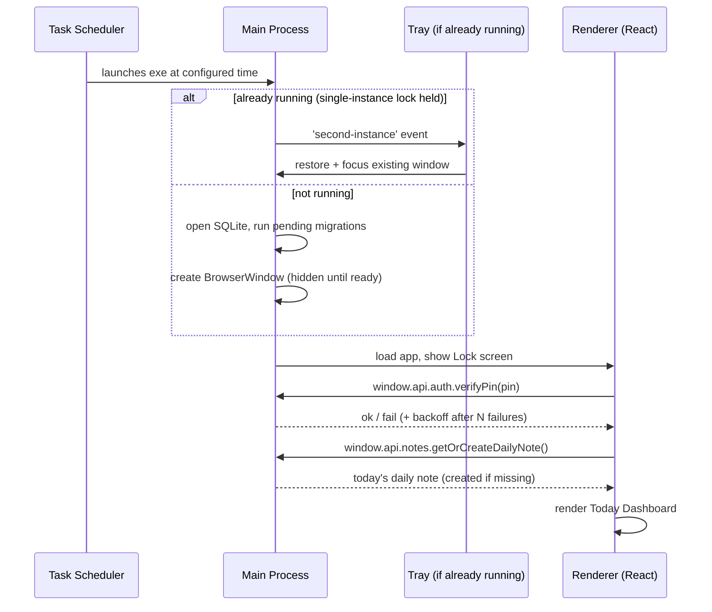

# Daily Dashboard — Architecture Design

Status: Draft from `/sc:design` (2026-07-24), based on `REQUIREMENTS.md`
Next step: `/sc:implement` per component, or `/sc:workflow` to sequence the build.

## 1. Confirmed Stack Decisions

| Decision | Choice | Why |
|---|---|---|
| Desktop shell | Electron (main + renderer + preload) | Windows desktop, Task Scheduler + system tray + native notifications all need Node/OS access from a main process |
| Frontend | React + TypeScript + Tailwind, bundled via Vite (`electron-vite`) | Mainstream ecosystem, fast dev loop, good fit for dashboard/calendar/chart components |
| Local database | SQLite via `better-sqlite3` | Relational queries needed for budget reports and recurring-event/reminder lookups; single portable file |
| Background persistence | App stays alive in system tray after the window is closed; Task Scheduler launch reuses the existing instance if already running | Resolves OQ-6 — reminders (FR-11) must fire all day, not just at the one daily launch |
| Recurrence engine | `rrule.js` (iCal RRULE strings) | Don't hand-roll recurrence math; well-tested, covers daily/weekly/monthly/custom patterns (FR-10) |
| Packaging | `electron-builder`, NSIS installer | Standard Windows installer output; needed to get a stable install path for Task Scheduler to target |

## 2. Process Architecture

```mermaid
graph TB
    subgraph Main Process (Node, has OS access)
        M[main.ts entrypoint]
        DB[(SQLite via better-sqlite3)]
        IPC[ipcMain handlers, grouped by domain]
        SCHED[Windows Task Scheduler bridge<br/>schtasks XML register/update]
        REM[Reminder loop<br/>polls due occurrences, fires toast]
        TRAY[Tray icon + menu]
        LOCK[PIN hash/verify - scrypt]
        M --> DB
        M --> IPC
        M --> SCHED
        M --> REM
        M --> TRAY
        M --> LOCK
        IPC --> DB
        REM --> DB
    end

    subgraph Preload (contextBridge, isolated)
        P[preload.ts<br/>exposes window.api.*]
    end

    subgraph Renderer Process (Chromium, no Node access)
        R[React app]
        LOCKUI[Lock screen]
        TODAY[Today dashboard]
        NOTES[Notes feature]
        SCH[Schedule feature]
        BUD[Budget feature]
        SET[Settings]
        R --> LOCKUI
        R --> TODAY
        R --> NOTES
        R --> SCH
        R --> BUD
        R --> SET
    end

    R -- window.api calls --> P
    P -- ipcRenderer.invoke --> IPC
    IPC -- ipcMain.handle replies --> P
    REM -- Notification API --> WinToast[Windows Toast]
    SCHED -- schtasks.exe --> TaskSched[Windows Task Scheduler]
    TaskSched -- launches at set time --> M
```

**Security boundary**: `contextIsolation: true`, `nodeIntegration: false`, `sandbox: true` on the renderer. The renderer never touches `fs`/`node:sqlite` directly — every DB read/write goes through `ipcMain.handle` in the main process via the typed `window.api` surface exposed by preload. This is non-negotiable even for a single-user local app: it keeps a compromised renderer (e.g. from a malformed note pasted as HTML) from getting arbitrary file-system access.

## 3. Directory Layout

```
daily-dashboard/
  electron/                      # main process (Node)
    main.ts                      # app lifecycle, window + tray creation, single-instance lock
    preload.ts                   # contextBridge exposure of window.api
    db/
      index.ts                   # connection, PRAGMA setup (WAL, foreign_keys=ON)
      migrations/
        0001_init.sql
      repositories/
        accounts.ts  transactions.ts  categories.ts  budgets.ts
        notes.ts  folders.ts  tags.ts
        schedule.ts  settings.ts
    ipc/
      accounts.ipc.ts  transactions.ipc.ts  notes.ipc.ts  schedule.ipc.ts
      settings.ipc.ts  dashboard.ipc.ts
    scheduler/
      taskSchedulerBridge.ts      # generates Task Scheduler XML, registers/updates via schtasks.exe
      reminderLoop.ts             # periodic due-occurrence scan -> Notification
    tray/
      tray.ts
    lock/
      auth.ts                    # scrypt hash/verify, lockout backoff
  src/                            # renderer (React)
    main.tsx  App.tsx
    features/
      lock/  dashboard/  notes/  schedule/  budget/  settings/
    state/                        # zustand stores per feature
    lib/
      rruleHelpers.ts  api.ts     # typed wrapper around window.api
  resources/                      # icons, tray icon, installer assets
  electron-builder.yml
  package.json
  REQUIREMENTS.md
  ARCHITECTURE.md
```

Data file location at runtime: `app.getPath('userData')/data.db` (e.g. `%APPDATA%/daily-dashboard/data.db`) — survives app updates since it's outside the install directory.

## 4. Data Model (SQLite)



```sql
-- 0001_init.sql

CREATE TABLE app_settings (
  key   TEXT PRIMARY KEY,
  value TEXT NOT NULL
);
-- keys used: launch_time ('07:30'), pin_hash, pin_salt,
-- lock_failed_attempts, lock_locked_until, default_currency

CREATE TABLE accounts (
  id              INTEGER PRIMARY KEY,
  name            TEXT NOT NULL,
  type            TEXT NOT NULL CHECK (type IN ('cash','bank','credit','other')),
  initial_balance REAL NOT NULL DEFAULT 0,
  currency        TEXT NOT NULL DEFAULT 'PHP',
  archived        INTEGER NOT NULL DEFAULT 0,
  created_at      TEXT NOT NULL DEFAULT (datetime('now'))
);

CREATE TABLE categories (
  id    INTEGER PRIMARY KEY,
  name  TEXT NOT NULL UNIQUE,
  kind  TEXT NOT NULL CHECK (kind IN ('expense','income')),
  color TEXT
);

CREATE TABLE budgets (
  category_id   INTEGER PRIMARY KEY REFERENCES categories(id) ON DELETE CASCADE,
  limit_amount  REAL NOT NULL,
  threshold_pct REAL NOT NULL DEFAULT 90,
  updated_at    TEXT NOT NULL DEFAULT (datetime('now'))
);

CREATE TABLE transactions (
  id                 INTEGER PRIMARY KEY,
  account_id         INTEGER NOT NULL REFERENCES accounts(id),
  category_id        INTEGER REFERENCES categories(id),
  type               TEXT NOT NULL CHECK (type IN ('expense','income','transfer')),
  amount              REAL NOT NULL,
  occurred_on        TEXT NOT NULL,          -- 'YYYY-MM-DD'
  note               TEXT,
  transfer_account_id INTEGER REFERENCES accounts(id),
  created_at         TEXT NOT NULL DEFAULT (datetime('now'))
);
CREATE INDEX idx_transactions_account_date ON transactions(account_id, occurred_on);
CREATE INDEX idx_transactions_category_date ON transactions(category_id, occurred_on);

CREATE TABLE note_folders (
  id        INTEGER PRIMARY KEY,
  name      TEXT NOT NULL,
  parent_id INTEGER REFERENCES note_folders(id)
);

CREATE TABLE notes (
  id         INTEGER PRIMARY KEY,
  folder_id  INTEGER REFERENCES note_folders(id),
  title      TEXT NOT NULL,
  body_md    TEXT NOT NULL DEFAULT '',   -- Markdown source (portable, diff/export-friendly)
  is_daily   INTEGER NOT NULL DEFAULT 0,
  note_date  TEXT,                        -- 'YYYY-MM-DD', set only when is_daily=1
  created_at TEXT NOT NULL DEFAULT (datetime('now')),
  updated_at TEXT NOT NULL DEFAULT (datetime('now'))
);
CREATE UNIQUE INDEX idx_notes_daily_date ON notes(note_date) WHERE is_daily = 1;

CREATE TABLE tags (
  id   INTEGER PRIMARY KEY,
  name TEXT NOT NULL UNIQUE
);

CREATE TABLE note_tags (
  note_id INTEGER NOT NULL REFERENCES notes(id) ON DELETE CASCADE,
  tag_id  INTEGER NOT NULL REFERENCES tags(id) ON DELETE CASCADE,
  PRIMARY KEY (note_id, tag_id)
);

CREATE TABLE schedule_items (
  id                      INTEGER PRIMARY KEY,
  title                   TEXT NOT NULL,
  description             TEXT,
  start_at                TEXT NOT NULL,   -- ISO datetime, first occurrence
  end_at                  TEXT,
  all_day                 INTEGER NOT NULL DEFAULT 0,
  recurrence_rule         TEXT,            -- RRULE string, NULL = one-off
  recurrence_end_at       TEXT,
  reminder_minutes_before INTEGER,         -- NULL = no reminder
  created_at              TEXT NOT NULL DEFAULT (datetime('now'))
);

-- Recurring items are expanded on the fly via rrule.js; only exceptions/
-- completions are persisted, per occurrence date.
CREATE TABLE schedule_completions (
  schedule_item_id INTEGER NOT NULL REFERENCES schedule_items(id) ON DELETE CASCADE,
  occurrence_date  TEXT NOT NULL,   -- 'YYYY-MM-DD'
  completed_at     TEXT,
  skipped          INTEGER NOT NULL DEFAULT 0,
  PRIMARY KEY (schedule_item_id, occurrence_date)
);

-- Dedupes toast notifications across app restarts within the same day
CREATE TABLE reminders_fired (
  schedule_item_id INTEGER NOT NULL REFERENCES schedule_items(id) ON DELETE CASCADE,
  occurrence_at    TEXT NOT NULL,   -- ISO datetime of the specific occurrence
  fired_at         TEXT NOT NULL DEFAULT (datetime('now')),
  PRIMARY KEY (schedule_item_id, occurrence_at)
);
```

Design notes:
- **Budgets are a standing limit per category** (FR-15), not per-month rows — matches "set a monthly budget for Food" as an ongoing rule. Spend-to-date is computed by summing `transactions` for the current month, not stored redundantly.
- **Recurring schedule items are never materialized into rows per occurrence.** `rrule.js` expands `recurrence_rule` against a date range at query time (for the daily list and calendar view); only completions and reminder-fired state are persisted, keyed by occurrence date. This avoids a growing table and keeps edits to the recurrence rule (e.g. changing time) apply retroactively/going-forward correctly.
- **Notes store Markdown**, not HTML/JSON, so data stays plain-text-portable (readable outside the app, diffable, easy to hand-export later per OQ-2/OQ-8) while still supporting FR-7's bold/lists/checkboxes via standard Markdown syntax (`- [ ]` for checkboxes).

## 5. Key Flows

### 5.1 Daily auto-launch, single instance, lock



- Enforced via `app.requestSingleInstanceLock()`; a second launch (Task Scheduler firing while the tray instance is already alive) never spawns a duplicate process — it just focuses the existing window. This is what makes "stays in the tray all day" and "auto-launches every morning" compatible.
- Closing the window (`X` button) is intercepted (`event.preventDefault()` in the `close` handler) and hides the window instead of quitting, unless the user picks **Quit** from the tray menu (which sets an `isQuitting` flag main checks in that handler).

### 5.2 Reminder loop (background, tray-resident)

- A `setInterval` in the main process (e.g. every 30s) asks: "which schedule occurrences (materialized via `rrule.js` for a lookahead window, e.g. next 24h) have `reminder_minutes_before` before now, and are not yet in `reminders_fired`?"
- For each due occurrence: fire `new Notification({...})` (Electron's native Notification, which renders as a Windows toast), then insert into `reminders_fired`.
- This runs independent of whether a window is open — only requires the main process to be alive, which the tray-persistence decision (3a) guarantees during the day.

### 5.3 Task Scheduler registration/update

- On first successful run (after PIN is set in onboarding) and whenever the user changes the launch time in Settings, the main process regenerates a Task Scheduler XML definition and registers it via `schtasks /Create /TN "DailyDashboard" /XML <tmpfile> /F`.
- The generated XML sets `<StartWhenAvailable>true</StartWhenAvailable>` — this resolves OQ-5: if the PC is off/asleep at the scheduled time, Windows runs the task as soon as possible after it becomes available, rather than silently skipping the day. (This flag isn't reachable through the simple `schtasks /Create /SC DAILY` flags — it requires the XML task definition form.)
- The task's action target is the installed `.exe` path (`process.execPath` in a packaged app), so this must be (re)registered after install/update if the path changes — `electron-builder`'s NSIS output keeps a stable install path across versions, so this only needs to happen once unless the user moves the install.

## 6. IPC Contract (`window.api`)

Exposed by `preload.ts` via `contextBridge.exposeInMainWorld('api', {...})`; every method is `ipcRenderer.invoke` under the hood, handled by `ipcMain.handle` in the matching `electron/ipc/*.ts` file. This is the only channel the renderer has to reach data — listed here as the interface contract, not implementation.

```ts
window.api = {
  auth: {
    isPinSet(): Promise<boolean>;
    setPin(pin: string): Promise<void>;
    verifyPin(pin: string): Promise<{ ok: boolean; lockedUntil?: string }>;
  };
  accounts: {
    list(includeArchived?: boolean): Promise<Account[]>;
    create(input: NewAccount): Promise<Account>;
    update(id: number, patch: Partial<NewAccount>): Promise<Account>;
    archive(id: number): Promise<void>;
  };
  transactions: {
    list(filter: { accountId?: number; categoryId?: number; from?: string; to?: string }): Promise<Transaction[]>;
    create(input: NewTransaction): Promise<Transaction>;
    update(id: number, patch: Partial<NewTransaction>): Promise<Transaction>;
    delete(id: number): Promise<void>;
  };
  categories: {
    list(): Promise<Category[]>;
    create(input: NewCategory): Promise<Category>;
  };
  budgets: {
    list(): Promise<BudgetWithSpend[]>;   // includes month-to-date spend, computed
    set(categoryId: number, limitAmount: number, thresholdPct?: number): Promise<void>;
  };
  notes: {
    listFolders(): Promise<NoteFolder[]>;
    createFolder(name: string, parentId?: number): Promise<NoteFolder>;
    listNotes(filter: { folderId?: number; tagId?: number }): Promise<NoteSummary[]>;
    getNote(id: number): Promise<Note>;
    saveNote(id: number, patch: { title?: string; bodyMd?: string; folderId?: number }): Promise<Note>;
    getOrCreateDailyNote(): Promise<Note>;
    listTags(): Promise<Tag[]>;
    tagNote(noteId: number, tagId: number): Promise<void>;
    untagNote(noteId: number, tagId: number): Promise<void>;
  };
  schedule: {
    listOccurrences(rangeStartISO: string, rangeEndISO: string): Promise<ScheduleOccurrence[]>;
    createItem(input: NewScheduleItem): Promise<ScheduleItem>;
    updateItem(id: number, patch: Partial<NewScheduleItem>): Promise<ScheduleItem>;
    deleteItem(id: number): Promise<void>;
    toggleCompletion(itemId: number, occurrenceDate: string): Promise<void>;
  };
  settings: {
    getLaunchTime(): Promise<string>;
    setLaunchTime(time: string): Promise<void>;   // also re-registers Task Scheduler entry
  };
  dashboard: {
    getToday(): Promise<{
      note: Note;
      schedule: ScheduleOccurrence[];
      budgetSnapshot: { accountBalances: AccountBalance[]; monthSpendByCategory: CategorySpend[] };
    }>;
  };
};
```

## 7. Non-Functional Requirements — How the Design Satisfies Them

| NFR | Design answer |
|---|---|
| NFR-1 Offline-first | No network calls anywhere in the design; all IPC stays within the local process pair |
| NFR-2 Local persistence | SQLite file in `userData`, WAL mode for crash-safety; versioned migrations in `db/migrations` |
| NFR-3 Startup performance | Vite-bundled renderer (small JS payload), `better-sqlite3` is synchronous/fast for this data volume, window created hidden and shown on `ready-to-show` to avoid a blank-white flash |
| NFR-4 Single-machine | No sync layer designed; nothing in the schema assumes multi-device merge |
| NFR-5 Windows-only | `schtasks.exe` bridge and Electron `Notification` (Windows toast backend) are both Windows-native; no cross-platform abstraction added |
| NFR-6 Data privacy | PIN stored as `scrypt(pin, salt)`, never plaintext; failed-attempt backoff in `lock/auth.ts`. DB-at-rest encryption (e.g. SQLCipher) is **not** included in this design — flagged as a remaining open item below since it wasn't explicitly requested |

## 8. Open Items Status (from REQUIREMENTS.md §5)

| # | Question | Status |
|---|---|---|
| OQ-1 | PIN recovery if forgotten | **Still open** — design assumes no recovery path (local-only tradeoff); needs a product decision (e.g. "reset wipes local data" vs. a recovery question) before implementing `lock/auth.ts` |
| OQ-2 | Backup/export | **Partially addressed** — Markdown note storage and a relational SQLite file make export straightforward to add later; no export UI designed yet, recommend adding a "Settings → Export" as a near-term follow-up, not blocking MVP |
| OQ-3 | Multi-currency | **Still open** — schema has a `currency` column per account (cheap to include now) but no conversion/aggregation logic across currencies designed; assume single-currency reporting for MVP unless clarified |
| OQ-4 | Task Scheduler setup UX | **Resolved** — §5.3, auto-registered on first run + re-registered on settings change |
| OQ-5 | Missed launch while PC is off | **Resolved** — §5.3, `StartWhenAvailable` in the XML task definition |
| OQ-6 | Notifications require app running | **Resolved** — tray-persistence decision (§1, §5.2) |
| OQ-7 | Rich text scope | **Resolved for MVP** — Markdown subset (bold/italic/lists/checkboxes), no embedded images; editor component choice deferred to implementation |
| OQ-8 | Budget report export | **Still open** — same as OQ-2, no CSV/PDF export designed yet |

## 9. Explicitly Not Designed Here

- PIN recovery flow (OQ-1) — needs a product decision first
- Export/backup UI (OQ-2/OQ-8) — schema supports it, no screens or IPC methods specced
- DB-at-rest encryption (SQLCipher or similar) — not requested, flagged as a hardening option
- Auto-update mechanism for the app itself — out of scope unless raised
