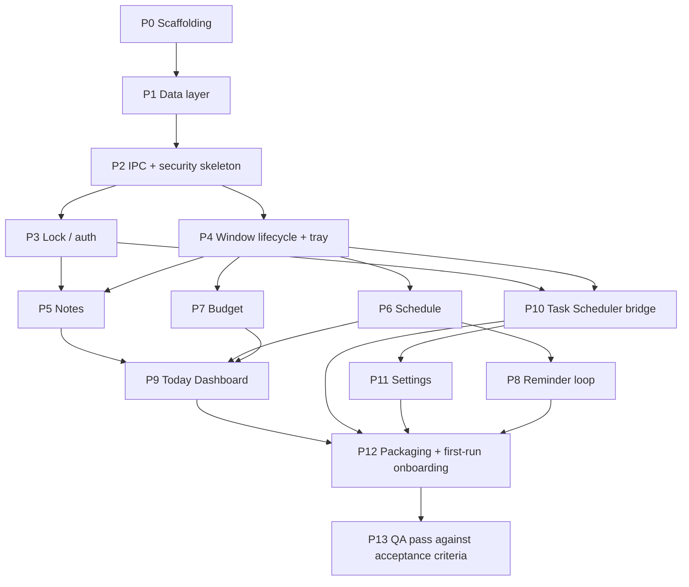

# Daily Dashboard — Implementation Workflow

Status: Draft from `/sc:workflow` (2026-07-24), based on `REQUIREMENTS.md` + `ARCHITECTURE.md`
This is a **plan only** — no code has been written or executed as part of generating this document.
Next step: `/sc:implement` to execute phases below, step by step.

## How to read this plan

- Each phase has tasks (`Tn.m`), what they depend on, and a **checkpoint**: a concrete way to verify the phase actually works before moving on.
- Requirement IDs (`FR-`, `NFR-`, `US-`) and architecture sections (`ARCH §`) are cited so you can trace any task back to *why* it exists.
- Phases are ordered by dependency, not by "feature importance" — e.g. the data layer comes before any UI because every feature reads/writes through it.

## Dependency overview

---

## Phase 0 — Project Scaffolding

**Goal**: an empty but runnable Electron + React + TS app with the directory layout from ARCH §3.

| Task | Description | Depends on |
|---|---|---|
| T0.1 | Init repo, `package.json`, TypeScript config, ESLint/Prettier | — |
| T0.2 | Scaffold via `electron-vite` (React + TS template), verify `npm run dev` opens a blank window | T0.1 |
| T0.3 | Add Tailwind, wire into renderer build | T0.2 |
| T0.4 | Create the full directory skeleton from ARCH §3 (`electron/db`, `electron/ipc`, `electron/scheduler`, `electron/tray`, `electron/lock`, `src/features/*`, `src/state`, `src/lib`) with placeholder files | T0.2 |
| T0.5 | Install core deps: `better-sqlite3`, `rrule`, `electron-builder` | T0.1 |

**Checkpoint**: `npm run dev` launches a window; `npm run build` produces output with no errors. No features yet.

---

## Phase 1 — Data Layer (ARCH §4)

**Goal**: SQLite schema and repositories exist and are independently testable, with zero dependency on Electron's UI layer.

| Task | Description | Depends on | Refs |
|---|---|---|---|
| T1.1 | `electron/db/index.ts` — connection, `PRAGMA journal_mode=WAL`, `PRAGMA foreign_keys=ON` | T0.5 | NFR-2 |
| T1.2 | Migration runner (applies `db/migrations/*.sql` in order, tracks applied versions in a `_migrations` table) | T1.1 | NFR-2 |
| T1.3 | `0001_init.sql` — full schema from ARCH §4 (accounts, categories, budgets, transactions, note_folders, notes, tags, note_tags, schedule_items, schedule_completions, reminders_fired, app_settings) | T1.2 | FR-4–FR-16 |
| T1.4 | Repository modules: `accounts.ts`, `categories.ts`, `budgets.ts`, `transactions.ts` — plain functions over the DB connection, no Electron imports | T1.3 | |
| T1.5 | Repository modules: `folders.ts`, `notes.ts`, `tags.ts` | T1.3 | |
| T1.6 | Repository modules: `schedule.ts` (CRUD + `rruleHelpers`-based occurrence expansion for a date range), `settings.ts` | T1.3, T0.5 (rrule) | FR-10 |
| T1.7 | Scratch script or ad-hoc test harness that exercises each repository against a temp DB file (create account, insert transaction, verify balance query; create recurring item, verify occurrence expansion) | T1.4–T1.6 | |

**Checkpoint**: T1.7's harness runs clean against a throwaway SQLite file — every repository function proven to work in isolation before any UI touches it. This is the single most load-bearing phase; bugs here surface everywhere downstream.

---

## Phase 2 — IPC + Security Skeleton (ARCH §2, §6)

**Goal**: the renderer↔main boundary exists and is locked down, before any real feature uses it.

| Task | Description | Depends on | Refs |
|---|---|---|---|
| T2.1 | `main.ts` — `BrowserWindow` with `contextIsolation: true`, `nodeIntegration: false`, `sandbox: true`; `app.requestSingleInstanceLock()` | T0.4 | ARCH §2 security boundary |
| T2.2 | `preload.ts` — `contextBridge.exposeInMainWorld('api', {})` stub, empty namespaces matching ARCH §6 contract shape | T2.1 | |
| T2.3 | Small internal helper for registering `ipcMain.handle` per domain consistently (so each `electron/ipc/*.ts` file follows the same pattern) | T2.1 | |
| T2.4 | `src/lib/api.ts` — typed renderer-side wrapper around `window.api` (so feature code never calls `window.api` raw) | T2.2 | |

**Checkpoint**: a trivial round-trip works — e.g. a temporary `ping` IPC method callable from a blank renderer page, proving preload/contextBridge/ipcMain wiring before building real handlers on top of it. Delete the `ping` stub once confirmed.

---

## Phase 3 — Lock / Auth (FR-1–FR-3, FR-19, US-2)

| Task | Description | Depends on |
|---|---|---|
| T3.1 | `electron/lock/auth.ts` — scrypt hash/verify, failed-attempt counter + backoff stored via `settings` repo | P1, P2 |
| T3.2 | `auth.ipc.ts` — `isPinSet`, `setPin`, `verifyPin` handlers | T3.1 |
| T3.3 | Renderer: onboarding "set your PIN" screen (first run, no `pin_hash` in settings) | T3.2 |
| T3.4 | Renderer: Lock screen shown before any other route; blocks navigation until `verifyPin` succeeds; surfaces backoff state | T3.2 |
| T3.5 | Routing guard so the Lock screen is unconditionally the first thing rendered, on every launch including auto-launch | T3.4, P4 |

**Checkpoint**: fresh install → forced PIN setup → restart app → locked on launch → wrong PIN rejected (and backoff kicks in after repeated failures) → correct PIN unlocks. Matches US-2's acceptance criteria exactly.

**Open item carried forward**: OQ-1 (forgot-PIN recovery) is not designed. Decide before or during T3.1 whether "forgot PIN" means "reset wipes local data" or something softer — this affects the auth module's shape.

---

## Phase 4 — Window Lifecycle + Tray (FR-17–FR-19, resolves OQ-6)

| Task | Description | Depends on | Refs |
|---|---|---|---|
| T4.1 | `tray/tray.ts` — tray icon, context menu (Open, Quit) | P2 | |
| T4.2 | Intercept window `close` → hide instead of quit, unless `isQuitting` flag set (via tray Quit) | T4.1 | ARCH §5.1 |
| T4.3 | `second-instance` handler — focus/restore existing window instead of spawning a new process | T2.1 | ARCH §5.1 |
| T4.4 | App router shell (React Router or simple state-based routing) with route stubs for Dashboard/Notes/Schedule/Budget/Settings | P2 | |

**Checkpoint**: launch app, close the window (X button) — process stays alive, tray icon remains, reopening from tray shows the same session. Launching the `.exe` again while already running just focuses the existing window rather than opening a second one.

---

## Phase 5 — Notes (FR-4–FR-7, US-3)

| Task | Description | Depends on |
|---|---|---|
| T5.1 | `notes.ipc.ts` — folders, notes CRUD, tags, `getOrCreateDailyNote` | P1, P3(routing), P4 |
| T5.2 | Renderer: folder tree sidebar (create/rename/nest folders) | T5.1 |
| T5.3 | Renderer: tag filter/assignment UI | T5.1 |
| T5.4 | Renderer: Markdown note editor (bold/italic/lists/checkboxes) — pick a lightweight editor component, store `body_md` on save (debounced autosave) | T5.1 |
| T5.5 | Wire `getOrCreateDailyNote` into app-open flow: on unlock, ensure today's daily note exists | T5.1, P3 |

**Checkpoint**: open app on a new day → daily note auto-created and visible in the folder tree → editing/checking a checkbox persists across restart. Matches US-3.

---

## Phase 6 — Schedule (FR-8–FR-11, US-4, US-7)

| Task | Description | Depends on | Refs |
|---|---|---|---|
| T6.1 | `schedule.ipc.ts` — `listOccurrences(range)` (uses `rruleHelpers` expansion from P1), `createItem`, `updateItem`, `deleteItem`, `toggleCompletion` | P1, P4 | |
| T6.2 | Renderer: daily task/event list, checkable off | T6.1 | FR-8 |
| T6.3 | Renderer: full calendar view (month/week grid) rendering expanded occurrences | T6.1 | FR-9 |
| T6.4 | Renderer: create/edit item form including recurrence rule builder (daily/weekly/monthly/custom, end condition) | T6.1 | FR-10 |
| T6.5 | Renderer: reminder-minutes-before field on the item form | T6.1 | FR-11 (setup half) |

**Checkpoint**: create a weekly recurring item → confirm it appears on the correct future dates in both list and calendar views without re-entry (US-7); check off today's occurrence and confirm it doesn't affect other occurrences.

---

## Phase 7 — Budget Tracker (FR-12–FR-16, US-5, US-6)

| Task | Description | Depends on | Refs |
|---|---|---|---|
| T7.1 | `accounts.ipc.ts`, `categories.ipc.ts`, `transactions.ipc.ts`, `budgets.ipc.ts` | P1, P4 | |
| T7.2 | Renderer: accounts list with running balances, create/edit/archive | T7.1 | FR-12 |
| T7.3 | Renderer: transaction entry form (account + category + amount + date + note), transfer support | T7.1 | FR-13, FR-16 |
| T7.4 | Renderer: category management | T7.1 | |
| T7.5 | Renderer: budget limit setting per category + threshold; visible warning state when month-to-date spend crosses threshold/limit | T7.1 | FR-15, US-6 |
| T7.6 | Renderer: reports — monthly spend by category, trend over time (pick a charting library, e.g. Recharts; follow the `dataviz` skill for chart/color conventions) | T7.1–T7.3 | FR-14 |

**Checkpoint**: create two accounts, log transactions across categories, confirm balances update immediately (US-5); set a category budget, log spend past the threshold, confirm the warning UI changes state distinctly at 100% vs. approaching (US-6).

---

## Phase 8 — Reminder Loop (FR-11 delivery half, ARCH §5.2)

| Task | Description | Depends on |
|---|---|---|
| T8.1 | `scheduler/reminderLoop.ts` — periodic scan (e.g. 30s) of upcoming occurrences vs. `reminder_minutes_before`, cross-checked against `reminders_fired` | P6 |
| T8.2 | Fire Electron `Notification` (native Windows toast) on due reminders; insert into `reminders_fired` | T8.1 |
| T8.3 | Start the loop on app boot (main process), independent of any window being open/focused | T8.1, P4 |

**Checkpoint**: create an event a few minutes out with a reminder; minimize/close the window (app stays in tray per P4); confirm the Windows toast fires on time without the window being open. This is the concrete test of the tray-persistence architecture decision.

---

## Phase 9 — Today Dashboard (FR-18, US-1, US-4)

| Task | Description | Depends on |
|---|---|---|
| T9.1 | `dashboard.ipc.ts` — `getToday()` aggregates: today's daily note, today's schedule occurrences, budget snapshot (balances + month spend by category) | P5, P6, P7 |
| T9.2 | Renderer: Today Dashboard screen combining all three sections, each deep-linking to its full feature view | T9.1 |
| T9.3 | Wire Today Dashboard as the landing route immediately after unlock | T9.2, P3 |

**Checkpoint**: unlock the app → Today Dashboard renders schedule + note + budget snapshot in one screen without extra navigation (US-4); clicking into any section navigates to its full view.

---

## Phase 10 — Task Scheduler Bridge (FR-17, resolves OQ-4/OQ-5)

| Task | Description | Depends on | Refs |
|---|---|---|---|
| T10.1 | `scheduler/taskSchedulerBridge.ts` — generate Task Scheduler XML (daily trigger at configurable time, `StartWhenAvailable=true`, action = current `process.execPath`) | P4 | ARCH §5.3 |
| T10.2 | Register/replace via `schtasks /Create /TN "DailyDashboard" /XML <tmpfile> /F`, invoked from Node `child_process` | T10.1 | |
| T10.3 | Trigger registration once onboarding (PIN set, P3) completes, using a default or user-chosen launch time | T10.2, P3 | |

**Checkpoint**: confirm the task appears in Windows Task Scheduler (`taskschd.msc`) with the correct trigger time and `StartWhenAvailable` set; manually run the task and confirm the existing tray instance is focused rather than a duplicate spawning (ties back to P4/T4.3).

---

## Phase 11 — Settings (supports FR-17 changes, PIN change)

| Task | Description | Depends on |
|---|---|---|
| T11.1 | `settings.ipc.ts` — `getLaunchTime`/`setLaunchTime` (calls into T10.2 to re-register the task on change) | P10 |
| T11.2 | Renderer: Settings screen — launch time picker, PIN change flow (re-uses T3.1/T3.2) | T11.1, P3 |

**Checkpoint**: change the launch time in Settings → confirm the underlying Task Scheduler entry's trigger time updates (check `taskschd.msc`) without creating a duplicate task.

---

## Phase 12 — Packaging + First-Run Onboarding (NFR-3, NFR-5)

| Task | Description | Depends on |
|---|---|---|
| T12.1 | `electron-builder.yml` — NSIS target, app icons, `userData` path sanity check | P9, P10, P11 |
| T12.2 | End-to-end first-run flow: install → launch → set PIN (P3) → set launch time (P11) → Task Scheduler entry registered (P10) → Today Dashboard shown | T12.1 |
| T12.3 | Verify data file survives an app reinstall/update (lives outside install dir per ARCH §3) | T12.1 |

**Checkpoint**: a clean Windows install, run through onboarding once, confirm the app reappears automatically at the configured time the next day without manual intervention.

---

## Phase 13 — QA Pass Against Acceptance Criteria

Run every `US-` acceptance criterion from `REQUIREMENTS.md` §4 explicitly, plus these architecture-specific edge cases:

| Check | Why it matters |
|---|---|
| PC asleep/off at scheduled time, then woken later | Validates `StartWhenAvailable` (OQ-5) actually behaves as expected on real Windows, not just XML correctness |
| Task Scheduler fires while app already open in tray | Validates single-instance focus behavior (P4/T4.3), no duplicate windows or processes |
| Recurring item edited mid-series (e.g. time change) | Confirms `rrule.js`-based expansion reflects the edit correctly for future occurrences |
| Budget threshold crossed exactly at boundary (90%, 100%) | Confirms warning-state UI logic (T7.5) matches US-6's acceptance criteria precisely |
| Repeated failed PIN entries | Confirms backoff (T3.1) actually throttles rather than just displaying a message |
| App left running for 24h+ | Confirms the reminder loop (P8) doesn't leak memory/timers and still fires correctly the next day |

**Checkpoint**: all `US-1`–`US-8` acceptance criteria pass manually; no regressions across features when exercising them in sequence (lock → dashboard → notes → schedule → budget → settings → tray → relaunch).

---

## Backlog (explicitly deferred, not part of this workflow)

Carried over from `ARCHITECTURE.md` §8/§9 — do not block MVP completion on these:

- OQ-1: PIN recovery/reset flow
- OQ-2 / OQ-8: Export/backup UI (notes to file, budget reports to CSV/PDF) — schema supports it, no screens built
- OQ-3: Multi-currency aggregation/conversion — `currency` column exists per account, no cross-currency logic
- DB-at-rest encryption (e.g. SQLCipher) — not requested, hardening option only
- App auto-update mechanism
